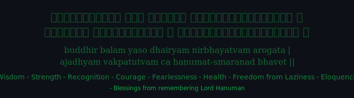

---

**Rapha** · Technology • Consciousness • Living Systems

---

### 💡 About Me

- 🌿 Exploring the intersection between **technology, consciousness and existential sovereignty**
- ⚙️ **Solutions architecture** & software engineering
- 🧭 **Digital sovereignty** & resilient systems
- 🌱 Focus: mind–life integration, nature and living systems

---

### 🛠️ Tech & Practice

| Area | Focus |
|------|--------|
| **Architecture** | Systems design, resilient & sovereign systems |
| **Engineering** | Software solutions, consulting |
| **Consciousness** | Integration, life systems, individual conversations |

---

### 🏆 Focus Areas

#### ⚙️ Solutions & Engineering
> _Architecture and software engineering for meaningful digital systems._

#### 🧭 Digital Sovereignty
> _Resilient systems, sovereignty and sustainable tech._

#### 🌿 Consciousness & Integration
> _Conversations and practice around mind, life and integration._

---

### 📊 GitHub Stats

---

### 🌐 Connect

---

### 🧊 3D Contribution Graph

> 🔮 _Generated by [github-profile-3d-contrib](https://github.com/yoshi389111/github-profile-3d-contrib) — tema night view (escuro). Para verde animado use `profile-green-animate.svg`; para cores customizadas use `SETTING_JSON` no workflow._

---

**© Sraphaz · Technology, Consciousness & Living Systems**

