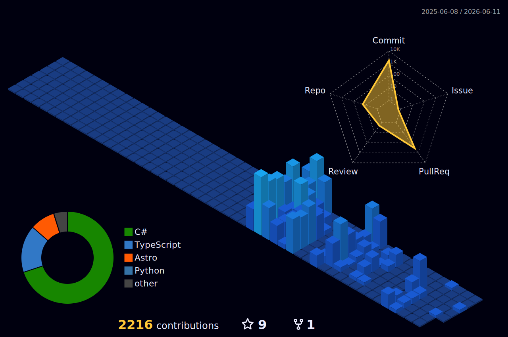

---

&nbsp;

&nbsp;

&nbsp;

---

---

### 📊 GitHub Stats

---

### 🌐 Connect

---

### 🧊 3D Contribution Graph

> 🔮 _Generated by [github-profile-3d-contrib](https://github.com/yoshi389111/github-profile-3d-contrib) — tema night view (escuro). Para verde animado use `profile-green-animate.svg`; para cores customizadas use `SETTING_JSON` no workflow._

---

**© Sraphaz · Technology, Consciousness & Living Systems**

